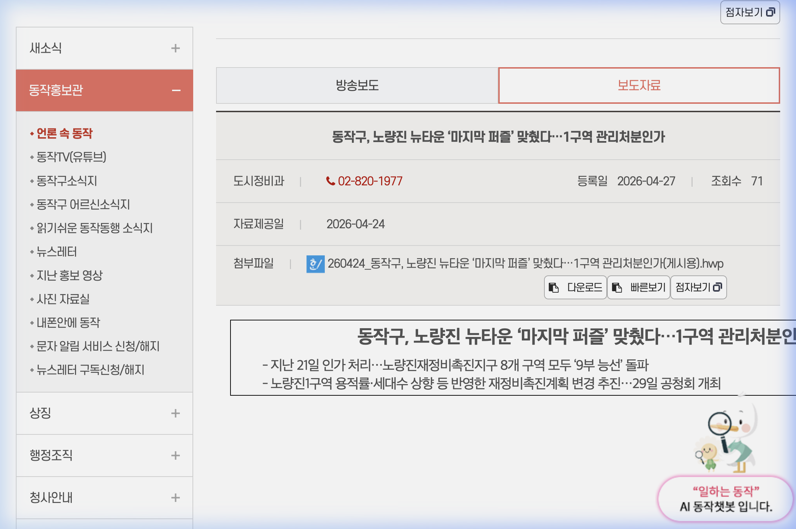

# 노량진1구역 관리처분계획인가 분석 및 정보몽땅 크롤러 최신화 보정 내역

## 1. 노량진1구역 관리처분계획인가 팩트 요약
동작구청에서 공표한 노량진1구역의 관리처분계획인가 고시(보도자료 기준) 세부사항은 다음과 같습니다.

* **구역명**: 노량진1재정비촉진구역 주택재개발정비사업 (노량진동 278-2번지 일대)
* **인가 처리일**: **2026년 4월 21일**
* **보도자료 공개일**: 2026년 4월 27일
* **사업 의의**: 
  - 노량진 뉴타운 내 총 8개 구역 중 **마지막으로 관리처분계획인가 단계**를 돌파하여 노량진재정비촉진지구 전역이 7부 능선을 넘게 됨.
  - 지하철 1·7·9호선 트리플 역세권을 아우르는 노량진 뉴타운 내 최대 규모의 구역.
* **사업 규모 및 설계 변경안**:
  - 용적률 상향안 추진 중 (기존 265.60% ➔ **299.33%** 상향 예정)
  - 최고 층수 **49층**, 총 세대수 **3,103세대** 규모의 대단지 초고층 주거 타운 예정.
* **향후 일정**:
  - 2026년 4월 29일 주민 공청회 개최 ➔ 5월 중 서울시 통합심의 상정 예정.
  - 2026년 하반기 중 본격적인 주민 이주 개시 목표.

---

## 2. 정보몽땅 크롤러 지연 보정 기술 내역
서울 정보몽땅(cleanup.seoul.go.kr)에 정보가 늦게 반영되어 실제 최신 진행 단계(예: 관리처분인가)와 불일치할 때, 크롤러가 자동으로 최신 팩트를 추적하여 보정해 주는 메커니즘을 적용했습니다.

### [1단계] 정보몽땅 마일스톤 추출 세부화
* 정보몽땅의 iframe 타임라인 단계들을 순회하며 `li.active` 클래스가 존재하고 실제 날짜가 표기된 최신 단계를 우선 파싱합니다.
* 활성화된 단계에 임시로 날짜가 생략된 경우(예: 행정이 완료되지 않아 주석 처리된 경우), 역순으로 루프를 돌며 날짜 데이터가 입력된 가장 최신의 마일스톤 정보를 수집하는 안전장치를 내장했습니다.

### [2단계] 뉴스/블로그 교차 검증 및 최신 단계 랭킹 비교
* 정보몽땅 추출 단계(`status_main`)와 네이버 수집 기사 분석을 거쳐 Gemini API가 도출한 최신 단계(`news_stage`)의 랭킹을 비교합니다.
* 뉴스 기사나 주력 블로거의 시황 포스트에서 더 진전된 단계(예: 사업시행인가 ➔ 관리처분인가)가 감지되면 데이터를 즉시 보정합니다.

### [3단계] 2차 실시간 RAG 기반 온라인 날짜 추적 파이프라인
* 만약 기사에서 단계는 진전되었으나 구체적 고시 날짜를 특정할 수 없는 경우, 크롤러가 백그라운드에서 실시간으로 **"구역명 + 단계명 + 날짜 고시일"** (예: `노량진1구역 관리처분인가 날짜 고시일`)로 모바일 네이버 통합 검색을 긴급 재수행합니다.
* 수집한 다수의 검색 결과 스니펫을 **한글 문장 단위 정규식(Regex) 필터**로 추출해 노이즈를 완전 제거한 뒤, Gemini API에 주입하여 정확한 고시일을 콕 집어 추출(RAG)해 냅니다.
* 수집된 날짜는 정보몽땅 규격 포맷인 `[ yy.mm.dd 단계명 ]` (예: `[ 26.04.21 관리처분인가 ]`)으로 가공되어 대시보드 및 데이터베이스의 `status_sub` 필드에 안전하게 주입됩니다.

---

## 3. 관련 증적 자료 (인가고시문 캡처)
* 동작구청 공식 인가 확인용 보도 및 고시 문서 캡처 완료.
* **로컬 저장 경로**: `/Users/seopro/Desktop/인가고시문_노량진1구역.png`

### 3-1. 동작구청 관리처분계획인가 고시문 이미지

